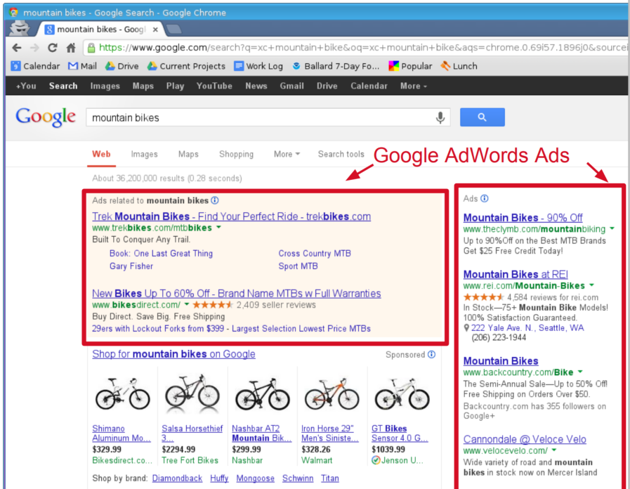
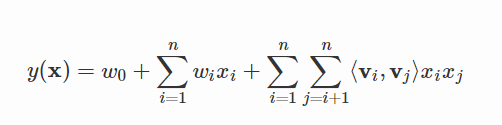
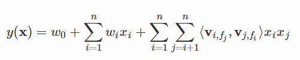
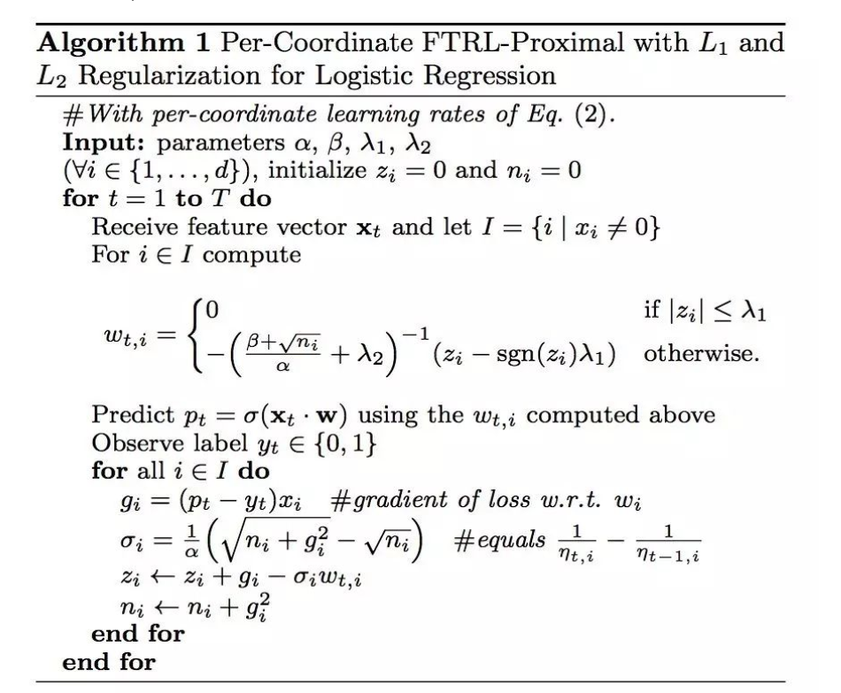

<!-- $theme: default -->

# CTR预估技术介绍
###### Fred
#
#
#
# http://www.julyedu.com/

---
# 目录
- 背景：什么是CTR预估
- CTR常见应用产品与场景
- 机器学习经典Formulation之一
- 常用算法及发展过程
- 常用工具及经典比赛
- 算法架构

---
# 背景：什么是CTR预估

- CTR（Click-Through-Rate）为点击率，起源自互联网广告，有人将它称作镶嵌在互联网技术上的明珠[1]
- charge = pv * cpm, cpm = sum(ctr*bid)[3]
- 如右图[2]

- 为什么要预估CTR
  - 排序
  - 最大化后验点击率
  - 最大化Revenue  	
--- 
# CTR常见应用产品与场景
- 最典型的场景：广告和推荐
	- 百度/Google的搜索广告
	- 阿里妈妈广告
	- 今日头条的信息流
- 其他
	- 任何0/1分类问题，比如：	 

--- 
# 机器学习经典Formulation之一
- 二分类问题
- label：y为0/1
- 特征：X
- 假设H：p(x) = H(X)
- Loss = -y log(p) - (1 - y) log(1 - p) 
- 评估：AUC/MAP

---
# 常用算法及发展过程
- 假设H: p(x) = H(x)
- LR/FM/FFM/FTRL
- GBDT
- Wide & Deep

---
# LR：逻辑回归

- 假设H: p(Y=1|x) = sigmod(-w*x)
	- 为什么逻辑回归要用Sigmoid函数[4]
- Loss = -y log(p) - (1 - y) log(1 - p) 
- 训练算法：
	- 凸优化：LBFGS/OWLQN/SGD, Batch Learning 	
- Overfitting
	- 正则化：L1/L2

--- 
# FM/FFM

- 假设H

- 深入FFM原理与实践[5]
- 目的
	- FM: 在解决稀疏数据下的特征组合问题
	- FFM: 通过引入field的概念，FFM把相同性质的特征归于同一个field。 

---
# FTRL[6]

  
- Batch Learning 
	- ###### 系统无法进行增量学习——即必须使用所有可用数据进行训练。这需要大量时间和计算资源，所以通常情形下，都是离线完成的
- Online Learning
	- ###### 可以循序渐进地给系统提供训练数据，逐步积累学习成果。这种提供数据的方式可以是单独地，也可以采用小批量（mini-batches）的小组数据来进行训练。每一步学习都很快速并且便宜，所以系统就可以根据飞速写入的最新数据进行学习

--- 
# FTRL
- Online Learning能否得到全局最优解？
- online learning https://courses.cs.washington.edu/courses/cse599s/14sp/
- 

---

# Ref

[1] 镶嵌在互联网技术上的明珠：漫谈深度学习时代点击率预估技术进展,https://zhuanlan.zhihu.com/p/54822778
[2] Ad Click Prediction: a View from the Trenches,https://courses.cs.washington.edu/courses/cse599s/14sp/kdd_2013_talk.pdf
[3] 机器知道你会点广告：写给普通人的CTR预估科普, https://baijiahao.baidu.com/s?id=1610035181636775323&wfr=spider&for=pc
[4] 为什么逻辑回归要用sigmoid 函数？ ,https://ask.julyedu.com/question/85100
[5] 深入FFM原理与实践, https://tech.meituan.com/2016/03/03/deep-understanding-of-ffm-principles-and-practices.html
[6] Mcmahan H B, Holt G, Sculley D, et al. Ad click prediction: a view from the trenches[C], KDD 2013.

---