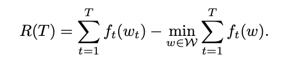
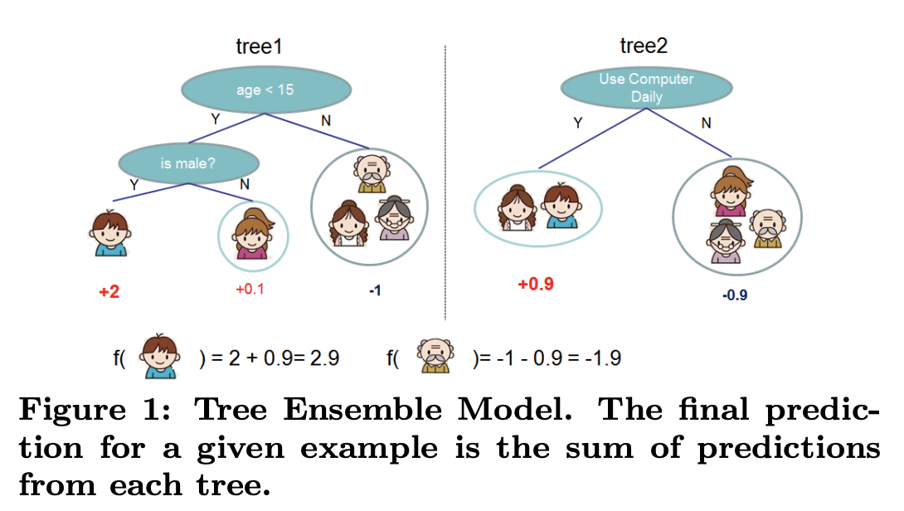
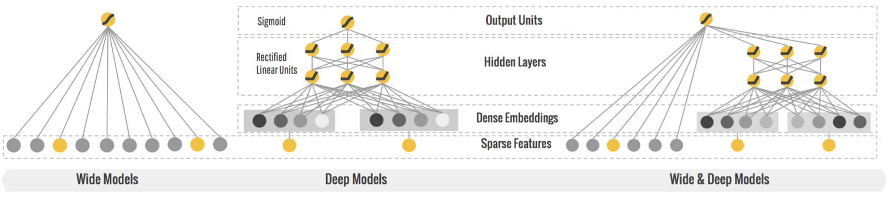
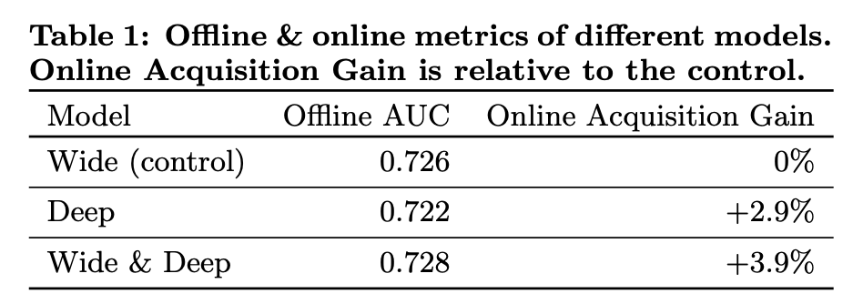
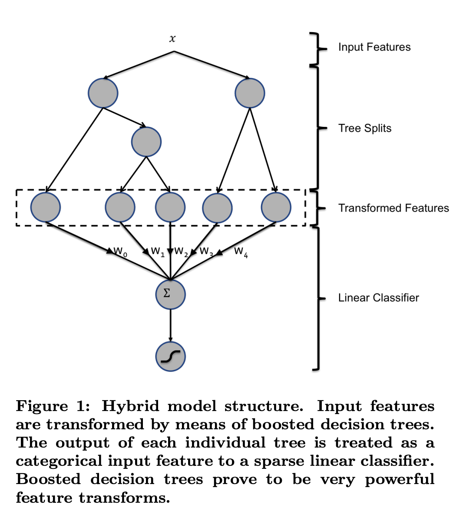
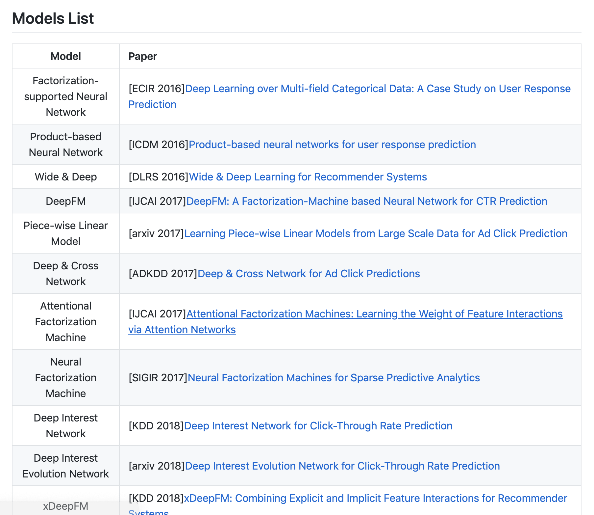

<!-- $theme: default -->

# CTR预估技术介绍
###### Fred
#
#
#
# http://www.julyedu.com/

---
# 写在最前面
- 整体介绍和梳理
- 大量的参考资料
- 典型的工具和例子
- 没有特别细节的代码和原理讲解
- 算法架构没有详细介绍

---
# 目录
- 背景：什么是CTR预估
- CTR常见应用产品与场景
- 机器学习经典Formulation之一
- 常用算法及发展过程
- 常用工具
- 经典比赛

---
# 背景：什么是CTR预估

- CTR（Click-Through-Rate）为点击率，起源自互联网广告，有人将它称作镶嵌在互联网技术上的明珠[1]
- charge = pv * cpm, cpm = sum(ctr*bid)[3]
- 如右图[2]

- 为什么要预估CTR
  - 排序
  - 最大化后验点击率
  - 最大化Revenue  	
--- 
# CTR常见应用产品与场景
- 最典型的场景：广告和推荐
	- 百度/Google的搜索广告
	- 阿里妈妈广告
	- 今日头条的信息流
- 其他
	- 任何0/1分类问题，比如：	 

--- 
# 机器学习经典Formulation之一
- 二分类问题
- label：y为0/1
- 特征：X
- 假设H：p(x) = H(X)
- Loss = -y log(p) - (1 - y) log(1 - p) 
- 评估：
	- offline: AUC/MAPE
	- online: 业务指标

---
# 常用算法及发展过程
- LR
- FM (Google)
- FFM (Criteo)
- FTRL (Google)
- GBDT
- Wide & Deep(Google)
- GBDT+LR(Facebook)

---
# LR：逻辑回归

- 假设H: p(Y=1|x) = sigmod(-w*x)
	- 为什么逻辑回归要用Sigmoid函数[4]
- Loss = -y log(p) - (1 - y) log(1 - p) 
- 训练算法：
	- 凸优化：LBFGS/OWLQN/SGD, Batch Learning 	
- Overfitting
	- 正则化：L1/L2
---
# LR
- 优点
	- 可解释性强
	- 大规模分布式实现容易
	- online更新
- 缺点
	- 模型表征能力有限

--- 
# FM/FFM

- 假设H

- 深入FFM原理与实践[5]
- 目的
	- FM: 在解决稀疏数据下的特征组合问题
	- FFM: 通过引入field的概念，FFM把相同性质的特征归于同一个field。 

---
# FTRL[6]

  
- Batch Learning 
	- ###### 系统无法进行增量学习——即必须使用所有可用数据进行训练。这需要大量时间和计算资源，所以通常情形下，都是离线完成的
- Online Learning
	- ###### 可以循序渐进地给系统提供训练数据，逐步积累学习成果。这种提供数据的方式可以是单独地，也可以采用小批量（mini-batches）的小组数据来进行训练。每一步学习都很快速并且便宜，所以系统就可以根据飞速写入的最新数据进行学习

--- 
# FTRL

- Online Learning能否得到全局最优解？

- Regret

- online learning https://courses.cs.washington.edu/courses/cse599s/14sp/

---
# GBDT

- 树模型+Ensemble
- 多个弱分类器
- GBDT与XGBoost的区别[7]
- 优点
	- 连续值统计特征
	- 模型比较鲁棒，但是参数不合理容易过拟合
	- 数据量较少时效果比LR/FM好
- 缺点
	- 树结构无法做online更新
	- 超大规模分布式实现比较困难

---
# Wide & Deep
- 很长一段时间，LR统治工业界的CTR预估
- Wide & Deep Learning: Better Together with TensorFlow[8]

--- 
# Wide & Deep

- Memorization 
	- Wide
- Generalization
	- Deep
- Explore & Exploit
	- MAB

---
# GBDT + LR

- 连续变量切分点如何选取
- 离散化为多少份合理
- 选择哪些特征交叉
- 多少阶交叉，二阶，三阶或更多
          

---
# 常用工具

- LR/FM/FFM
	- liblinear https://www.csie.ntu.edu.tw/~cjlin/liblinear/ 
	- Spark MLlib
		- https://spark.apache.org/docs/2.3.0/mllib-optimization.html
		- LBFGS/SGD 
	- https://github.com/ycjuan/libffm

	- https://github.com/dmlc/difacto 
	

--- 
# 常用工具
- GBDT
	- XGBoost, https://xgboost.readthedocs.io/en/latest/
	- LightGBM,https://lightgbm.readthedocs.io/en/latest/

---
# 常用工具

- Wide & Deep
	- TensorFlow教程[10]
	- Google Colab https://colab.research.google.com/
- DeepCTR
https://github.com/shenweichen/DeepCTR
- 由此可见这个问题多火

---
# 经典比赛
- Kaggle Click-Through Rate Prediction https://www.kaggle.com/c/avazu-ctr-prediction
- FFM winner
	- https://github.com/ycjuan/kaggle-avazu
    - 特征工程
- 非常好的练习题
	- 先复现冠军的解法
	- 尝试GBDT，Wide & Deep的算法   

---

# Ref

[1] 镶嵌在互联网技术上的明珠：漫谈深度学习时代点击率预估技术进展,https://zhuanlan.zhihu.com/p/54822778
  
[2] Ad Click Prediction: a View from the Trenches,https://courses.cs.washington.edu/courses/cse599s/14sp/kdd_2013_talk.pdf

[3] 机器知道你会点广告：写给普通人的CTR预估科普, https://baijiahao.baidu.com/s?id=1610035181636775323&wfr=spider&for=pc

[4] 为什么逻辑回归要用sigmoid 函数？ ,https://ask.julyedu.com/question/85100

[5] 深入FFM原理与实践, https://tech.meituan.com/2016/03/03/deep-understanding-of-ffm-principles-and-practices.html

[6] Mcmahan H B, Holt G, Sculley D, et al. Ad click prediction: a view from the trenches[C], KDD 2013.

[7] 机器学习算法中 GBDT 和 XGBOOST 的区别有哪些？,https://www.zhihu.com/question/41354392

[8] Wide & Deep Learning: Better Together with TensorFlow, https://ai.googleblog.com/2016/06/wide-deep-learning-better-together-with.html

[9] Practical Lessons from Predicting Clicks on Ads at Facebook, https://research.fb.com/publications/practical-lessons-from-predicting-clicks-on-ads-at-facebook/

[10] Predicting Income with the Census Income Dataset, https://github.com/tensorflow/models/tree/master/official/wide_deep 

---