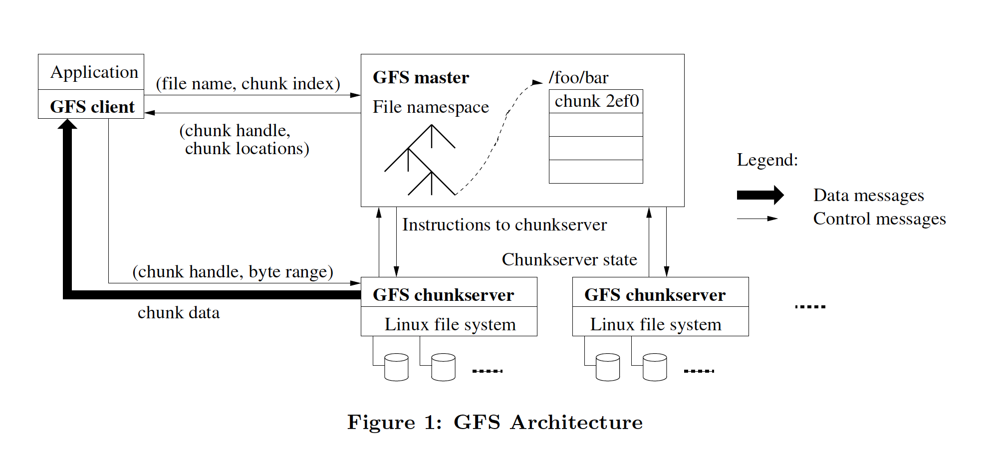

GFS 阅读笔记

# Introduction

GFS 相比以前的分布式文件系统的如下不同：
  - component failures are the norm rather than the exception.
  - files are huge by traditional standards. Multi-GB files are common.
  - most files are mutated by appending new data rather than overwriting existing data.
  - co-designing the applications and the file system
API benefits the overall system by increasing our flexibility.

# Design Overview

## Assumptions
  - 系统依赖的机器经常会挂掉，所以需要具备自恢复能力。
    The system is built from many inexpensive commodity components that often fail. It must constantly monitor itself and detect, tolerate, and recover promptly from component failures on a routine basis.

  - 系统存储适量大文件，通常情况下100M甚至几个GB。需要支持小文件，但是不会为小文件做特别优化
    The system stores a modest number of large files. We expect a few million files, each typically 100 MB or larger in size. Multi-GB files are the common case and should be managed efficiently. Small files must be supported, but we need not optimize for them.

  - workloads主要是large streaming reads和small random reads。large streaming reads 每次读取1MB甚至更多，连续读取文件region。random reads随机读取offset，每次读取KB。

  - workloads也包括large，sequential writes。small random writes也支持，但是不需要特别优化。

  - 文件系统必须高效的支持多重写入。
  The system must efficiently implement well-defined semantics for multiple clients that concurrently append to the same file.

  - High sustained bandwidth is more important than low latency.

## Interface
  - create, delete, open, close, read, write
  - snapshot, record append

## Architecture

  
  master -> namenode， chunkserver -> datanode，client和chunkserver都不cache data

  - chunk && chunkserver
    - 文件被分成fixed-size chunks，每个chunk具有全局唯一id(chunk handle)
    - chunkserver将chunk当做linux文件存在本地磁盘，根据chunk handle和byte range读写chunk data，默认三副本保存。

  - master负责：
    - 维护整个文件系统的metadata，包括：namespace, access control information, the mapping from files to chunks, and the current locations of chunks
    - 控制system-wide activities，包括：chunk lease management, garbage collection of orphaned chunks, and chunk migration between chunkservers.
    - The master periodically communicates with each chunkserver in HeartBeat messages to give it instructions and collect its state.

  - client:
    - 实现文件系统API
    - 和master通信实现对metadata的operations
    - 和chunkserver通信read/write data
