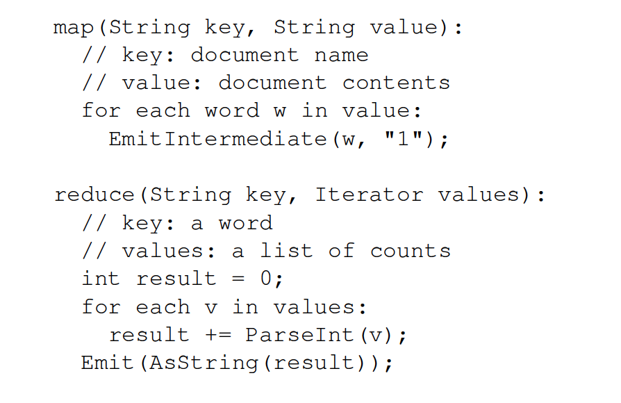

<!-- $theme: default -->

# MapReduce && GFS
###### 杨宝兴
#
#
#
#


Ref: 6.824: Distributed Systems: https://pdos.csail.mit.edu/6.824/schedule.html

---
# 目录

- 分布式计算/系统
	- 重要性
 	- 分布式系统应用从入门到放弃
 	- Hadoop/Hbase/Hive/YARN
- Google分布式计算三驾马车
- GFS
- MapReduce
	- Programming Model
	- Implementation


---

# Distributed computing/systems

Distributed computing is a field of computer science that studies distributed systems. 
A distributed system is a system whose components are located on different networked computers, which then communicate and coordinate their actions by passing messages to one other.

Ref: https://en.wikipedia.org/wiki/Distributed_computing

---
# 分布式系统重要性


---
# 分布式系统应用从入门到放弃

- 从策略/算法/数据/机器学习 工程师(科学家)的角度 
- 工欲善其事，必先利其器
- 熟悉MapReduce的原理
- 熟练使用Hadoop Streaming
- 熟练使用Spark/Kafka
- 熟悉Parameter Server
- 熟悉TensorFlow(会有一天变成跟Hadoop一样普及的工具)
- 个人见解，可以拍，不要怂


--- 
# Hadoop

Apache Hadoop is a collection of open-source software utilities that facilitate using a network of many computers to solve problems involving massive amounts of data and computation. <div style="color:#F00">It provides a software framework for distributed storage and processing of big data using the MapReduce programming model.</div>

---

# HDFS
The Hadoop Distributed File System (HDFS) is a distributed file system designed to run on commodity hardware. HDFS is now an Apache Hadoop subproject.

commodity： 廉价

---

# HBase
Apache HBase is the Hadoop database, a distributed, scalable, big data store.
(Redis ?)

# Hive
The Apache Hive ™ data warehouse software facilitates reading, writing, and managing large datasets residing in distributed storage using SQL. Structure can be projected onto data already in storage. A command line tool and JDBC driver are provided to connect users to Hive.
(Mysql?)


---

# YARN

######  The fundamental idea of YARN is to split up the functionalities of resource management and job scheduling/monitoring into separate daemons. The idea is to have a global ResourceManager (RM) and per-application ApplicationMaster (AM). An application is either a single job or a DAG of jobs.

###### The ResourceManager and the NodeManager form the data-computation framework. The ResourceManager is the ultimate authority that arbitrates resources among all the applications in the system. The NodeManager is the per-machine framework agent who is responsible for containers, monitoring their resource usage (cpu, memory, disk, network) and reporting the same to the ResourceManager/Scheduler.

###### The per-application ApplicationMaster is, in effect, a framework specific library and is tasked with negotiating resources from the ResourceManager and working with the NodeManager(s) to execute and monitor the tasks.

https://www.ibm.com/developerworks/library/bd-yarn-intro/index.html

---


# 目录

- 分布式计算/系统
	- 重要性
 	- 分布式系统应用从入门到放弃
 	- Hadoop/Hbase/Hive/YARN
- <div style="color:#F00">Google分布式计算三驾马车</div>
- GFS
- MapReduce
	- Programming Model
	- Implementation

---
# Google分布式计算三驾马车
- GFS[2003]
	- a <b>scalable distributed file system</b> for large distributed data-intensive applications.
- MapReduce[2004]
	- a <b>programming model</b> and an associated implementation for processing and generating big data sets with a parallel, distributed algorithm on a cluster. 
 
- BigTable[2006]
	- a <b>distributed storage system</b> for managing
structured data that is designed to scale to a very large size: petabytes of data across thousands of commodity servers

---
# The Google File System(2003)


Sanjay Ghemawat
Howard Gobioff
Shun-Tak Leung

A scalable distributed file system for large distributed data-intensive applications.

[Jeff Dean的激荡人生：我和Sanjay在同一台电脑上写代码](
https://mp.weixin.qq.com/s/s-_Z_sM7WmyizVDtgW-UYQ)

---
# File System

A filesystem is the methods and data structures that an operating system uses to keep track of files on a disk or partition; that is, the way the files are organized on the disk. The word is also used to refer to a partition or disk that is used to store the files or the type of the filesystem. Thus, one might say ``I have two filesystems'' meaning one has two partitions on which one stores files, or that one is using the ``extended filesystem'', meaning the type of the filesystem.


Ref: http://web.stanford.edu/~ouster/cgi-bin/cs140-spring18/lectures.php

---

# Problems addressed by modern file systems:
- Disk Management:
	- Fast access to files (minimize seeks)
	- Sharing space between users
	- Efficient use of disk space
- Naming: how do users select files?
- Reliability: information must survive OS crashes and hardware failures.
- Protection: isolation between users, controlled sharing.


---
# Distributed File Systems

- Aim: allow users of physically distributed computers to share data and storage resources by using a common file system. 

- Issues In Distributed Files Systems
	- Transparency/Flexibility/Reliability 
	- Performance/Scalability
- Represent
	- NFS
	- AFS
	- GFS(HDFS)


Ref: http://vlab.wikispaces.asu.edu/file/view/NFS+AFS+GFS.pptx
https://www.andrew.cmu.edu/course/95-702/
https://web.cs.wpi.edu/~rek/DCS/D04/DFS.pdf

---
# NFS
Client-Server Architecture. It provides a standardized view of the local file system. Clients access the server transparently through an interface similar to the local file system interface. Client-side caching may be used to save time and network traffic. Server defines and
performs all file operations. 


---

# 目录
- Why GFS?
- GFS相比以前的分布式文件系统不同点
- Design Overview
- System Interactions
- Master Operations
- Fault Tolerance And Diagnosis	 


--- 
# Why GFS?
Driven by key observations of our application workloads and technological environment, both current and anticipated.

A scalable distributed file system for large distributed
data-intensive applications.

Running on inexpensive commodity hardware, and it delivers
high aggregate performance to a large number of clients.

---
# GFS相比以前的分布式文件系统
- component failures are the norm rather than the exception.
- files are huge by traditional standards. Multi-GB files are common.
- most files are mutated by appending new data rather than overwriting existing data.
- co-designing the applications and the file system API benefits the overall system by increasing our flexibility.


---

# Design Overview
- Assumptions
- Interface
- Architecture
- Single Master
- Metadata
- Consistency Model

---

# Assumptions

- 系统依赖的机器经常会挂掉，所以需要具备自恢复能力。
    The system is built from many inexpensive commodity components that often fail. It must constantly monitor itself and detect, tolerate, and recover promptly from component failures on a routine basis.
- 系统存储适量大文件，通常情况下100M甚至几个GB。需要支持小文件，但是不会为小文件做特别优化
    The system stores a modest number of large files. We expect a few million files, each typically 100 MB or larger in size. Multi-GB files are the common case and should be managed efficiently. Small files must be supported, but we need not optimize for them.

---

  - workloads主要是large streaming reads和small random reads。large streaming reads 每次读取1MB甚至更多，连续读取文件region。random reads随机读取offset，每次读取KB。

  - workloads也包括large，sequential writes。small random writes也支持，但是不需要特别优化。

---
  - 文件系统必须高效的支持多重写入。
  The system must efficiently implement well-defined semantics for multiple clients that concurrently append to the same file.

  - High sustained bandwidth is more important than low latency.


---

# Interface
 - Not POSIX-compliant, but supports typical file system operations: create,delete, open, close, read, and write
- snapshot: creates a copy of a file or a directory tree at low cost
- record append: allow multiple clients to append data to the same file concurrently
	- At least the very first append is guaranteed to be atomic

--- 

# Architecture
GFS cluster consists of a single master and multiple chunkservers and is accessed by multiple clients。


---

# Architecture

- Very important: data flow is decoupled from control flow
	- Clients interact with the master for metadata operations
	- Clients interact directly with chunkservers for all files operations
	- This means performance can be improved by scheduling expensive data flow based on the network topology
- Neither the clients nor the chunkservers cache file data
	- Working sets are usually too large to be cached, chunkservers can use Linux’s buffer cache

---

# Chunk && Chunkserver(DataNode)

- 文件被分成fixed-size chunks，每个chunk具有全局唯一id(chunk handle)
- chunkserver将chunk当做linux文件存在本地磁盘，根据chunk handle和byte range读写chunk data，默认三副本保存。


---
# Master(NameNode)
   - 维护整个文件系统的metadata
   		- namespace/access control information
   		- the mapping from files to chunks
   		- and the current locations of chunks
   - 控制system-wide activities
   		- chunk lease management
   		- garbage collection of orphaned chunks
   		- chunk migration between chunkservers.
   - The master periodically communicates with each chunkserver in HeartBeat messages to give it instructions and collect its state.

---


# Client
- 实现文件系统API
- 和master通信实现对metadata的operations
- 和chunkserver通信read/write data

--- 
# Single Master

single master极大的简化了设计，使得master可以利用全局信息make sophisticated chunk placement and replication decisions.

当然，必须最小化master在文件系统读写中的工作，这样single master才不会成为系统的bottleneck。client never通过master读写file data。client请求mater来获取自己需要和那台chunkserver交互。client从master拿到的信息需要cache。


---
# Metadata

- 三种主要的Metadata，保存在Master的内存中

	- the file and chunk namespaces 
	- the mapping from files to chunks 
	- the locations of each chunk’s replicas

- Operation Log
	- contains a historical record of critical metadata changes.
	- a logical time line that defines the order of concurrent operations.
	- The master recovers its file system state by replaying the
operation log.


---
# Consistency Model


--- 
# System Interactions
- Leases and Mutation Order
- Data Flow
- Atomic Record Appends
- Snapshot

how the client, master, and chunkservers interact to implement data mutations, atomic record append, and snapshot.

---
# Leases and Mutation Order

- Mutation: an operation that changes the contents or metadata of a chunk 
	- such as: write/append operation.
	- performed at all the chunk’s replicas.
- Lease: 租约 
	- We use leases to maintain a consistent mutation order across replicas.

Ref: https://lrita.github.io/2018/10/29/lease-in-distributed-system/

---
 If the master receives a modification operation for a particular chunk:
- <font size=5>Master finds the chunkservers that have the chunk and grants a chunk lease to one of them</font>
<font size=4>
	- This server is called the primary, the other servers are called secondaries</font><font size=4>
	- The primary determines the serialization order for all of the chunk’s modifications, and the secondaries follow that order</font>
- <font size=5>After the lease expires (~60 seconds), master may grant primary status to a different server for that chunk</font><font size=4>
	- The master can, at times, revoke a lease (e.g. to disable modifications when file is being renamed)</font><font size=4>
	- As long as chunk is being modified, the primary can request an extension indefinitely</font>
- If master loses contact with primary, that’s okay: just grant a new lease after the old one expires

---

# 举个例子


1. Client asks master for all chunkservers (including all secondaries)

2. Master grants a new lease on chunk, increases the chunk version number, tells all replicas to do the same. Replies to client. Client no longer has to talk to master


---


3. Client pushes data to all servers, not necessarily to primary first

4. Once data is acked, client sends write request to primary. Primary decides serialization order for all incoming modifications and applies them to the
chunk

---


5. After finishing the modification, primary forwards write request and serialization order to secondaries, so they can apply modifications in same order. (If primary fails, this step is never reached.)
6. All secondaries reply back to the primary once they finish the modifications

---

7. Primary replies back to the client, either with success or error
- If write succeeds at primary but fails at any of
the secondaries, then we have inconsistent
state → error returned to client
- Client can retry steps (3) through (7)


---
# Data Flow
Control flows from the client to the primary and then to all secondaries

Data is pushed linearly along a carefully picked chain of chunkservers
in a pipelined fashion.


Pipelining makes use of the full outbound bandwidth for the fastest
possible transfer, instead of dividing it in a non-linear topology.


---

# Atomic Record Appends
- Client specifies data

- GFS appends it to the file atomically at least once
	- GFS picks the offset
	- In contrast, a “regular” append is merely a write at an offset that the client believes to be the current end of file.
	- Used heavily by Google apps
  	e.g., for files that serve as multiple-producer/singleconsumer
queues

---
# Snapshot
文件系统快照

Copy-On-Write 写时复制技术


---

每当 Master 收到 Snapshot 请求时，

1. Master 首先并不是进行映像的复制操作，而是查询租约的拥有者即 Primary 并通知它，保证 Master 可以获取到后续的所有读写操作的请求。

2. 复制metadata

3. 当后续产生写操作时，Master 就会通知所有该 chunk 的 replicas，将该 chunk 进行复制备份，产生另外一个 chunk 映像，然后将映像地址返回给 client 让其进行读写，而原来的 chunk 就自然形成了一个 snapshot，不会再对其进行修改。


---

# Master Operatition
- Namespace Management and Locking
- Replica Placement
- Creation, Re-replication, Rebalancing
- Garbage Collection
- Stale Replica Detection


---
# Namespace Management and Locking
When there are leases in the chunk server, those leases are granted only through master.
GFS logically represents its namespace as a lookup table mapping full pathnames to metadata. 
  - With prefix compression, this table can be efficiently represented in memory. 
Each node in the namespace tree (either an absolute file name or an absolute directory name) has an associated read-write lock.


---
# Replica Placement

Serves two purposes
- Maximize data reliability and availability
- Maximize network bandwidth utilization

Spread chunk replicas across racks
- To ensure chunk survivability
- To exploit aggregate read bandwidth of multiple racks
- write traffic has to flow through multiple racks

---
# Creation, Re-replication, Rebalancing


---
# Garbage Collection

---
# Stale Replica Detection

---


# MapReduce: Simplified Data Processing on Large Clusters(2004)

Jeff Dean, Sanjay Ghemawat


Ref: https://ai.google/research/pubs/pub62

---

# Programming Model

Input & Output: each a set of key/value pairs

Programmer specifies two functions:
- map (in_key, in_value) -> list(out_key, intermediate_value)

	- 	Processes input key/value pair
	- 	Produces set of intermediate pairs

- reduce (out_key, list(intermediate_value)) -> list(out_value)
	- Combines all intermediate values for a particular key
	- Produces a set of merged output values (usually just one)


Inspired by similar primitives in LISP and other languages

Ref: https://research.google.com/archive/mapreduce-osdi04-slides/index-auto-0003.html

---

# Programming Model



#### Map
- Input: Pair
- Output: Key/Value pairs
	- K1, V11
	- K2, V21
	- K1, V12...

#### Reduce
- Input: K1, V11, V12, ...
- Output: K1, V

#### MapReduce Library
- groups together all intermediate values associated with the same intermediate key I and passes them to the Reduce function.

---
# More Example
- Count of URL Access Frequency
	- Map: <URL, 1>
	- Reduce: <URL, total count> 	
- ReverseWeb-Link Graph
	- Map: <target, source>
	- Reduce: <target, list(source)>

--- 
# Hadoop Streaming
Hadoop Streaming是Hadoop提供的一个编程工具，它允许用户使用任何可执行文件或者脚本文件作为Mapper和Reducer

```
$HADOOP_HOME/bin/hadoop  jar $HADOOP_HOME/hadoop-streaming.jar \
    -input myInputDirs \
    -output myOutputDir \
    -mapper /bin/cat \
    -reducer /bin/wc
```


Ref: Hadoop Streaming http://hadoop.apache.org/docs/r2.7.2/hadoop-streaming/HadoopStreaming.html

---

# How It Works
- the mapper and the reducer are executables
	- read the input from stdin (line by line) 
	- emit the output to stdout
- Mapper：Output <K, V1>pair per line，the prefix of a line up to the first tab character is the key and the rest of the line (excluding the tab character) will be the value.
- Reducer: 所有K一样的V1会连续从stdin读入，输出K，V2

---
# Word Count
## Map
   ???
## Reduce
   ???

---
# Mapper
```
def map():
    for line in sys.stdin:
        fs = line[:-1].split()
        fs = [ item.strip() for item in fs ]
        for word in fs:
            sys.stdout.write("%s\t1\n" % word)
```

---

# Reducer

```
def reduce():
    last_word = None
    cnt_sum = 0
    for line in sys.stdin:
        word, cnt = line[:-1].split("\t")
        if word != last_word:
            emit_reduce(last_word, cnt_sum)
            last_word = word
            cnt_sum = 0
        cnt_sum += int(cnt)
    emit_reduce(last_word, cnt_sum)    
    
    
def emit_reduce(last_word, cnt_sum):
	if last_word is None：
    	return
    sys.stdout.write("%s\t%d\n" % (last_word, cnt_sum))
         
```

---
# Practice

Building Inverted Index in MapReduce

map:
reduce:

---
# Implementation: Intro
- Map
	- Partition Input Data M Splits
	- Assgin each splits a worker 
	- Worker output <k, v> pairs
	- <k, v> written to local disks
- Reduce
	- partitioning the intermediate key space into R pieces using a partitioning function (e.g.,hash(key) mod R).	
	- data are transfered from mapper to reducer
	- reducer output <k，v2> pairs
---

# Implementation: Execution overview


---
# Implementation: Master


---


---
# Refinements


---
Ref:

https://ijcsit.com/docs/Volume%205/vol5issue03/ijcsit20140503234.pdf
https://cs.stanford.edu/~matei/courses/2015/6.S897/slides/gfs.pdf
https://web.cs.wpi.edu/~rek/DCS/D04/DFS.pdf
http://www.ccs.neu.edu/home/ntuck/courses/2016/09/cs6240/notes/Handouts/Module2-L2-handout.pdf
http://google-file-system.wikispaces.asu.edu/
http://prof.ict.ac.cn/DComputing/uploads/2013/DC_4_0_GFS_ICT.pdf
https://ucbrise.github.io/cs262a-spring2018/notes/17-GFS-BigTable.pdf
https://web.eecs.umich.edu/~manosk/assets/slides/w18/GFS.pdf
https://www.slideshare.net/romain_jacotin/the-google-file-system-gfs

---